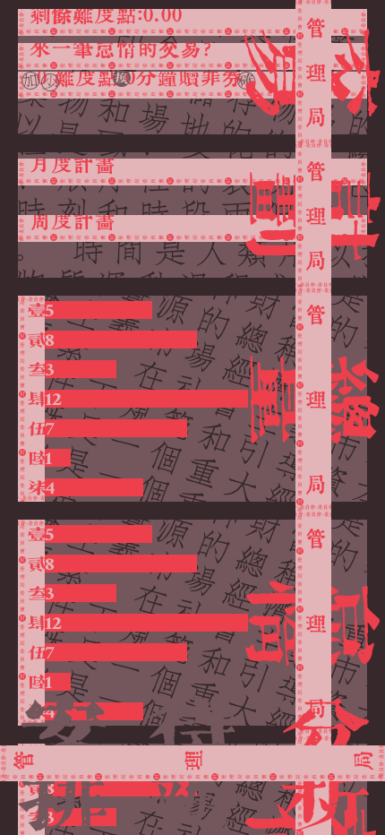

# Sloth

Sloth 是一个接入 AI 大模型服务、以“怠惰值”为核心机制的自动任务规划应用。用户只需要输入月度目标和周度目标，应用会调用大模型自动生成计划建议、任务书和待办拆解，并用怠惰值把工作、学习和娱乐时间放进同一套可管理的节奏里。

它的使用节奏很直接：先让 AI 把目标写成可推进的任务书，再把任务拆成待办，最后用完成待办得到的怠惰值兑换休息时间。Sloth 试图把“今天该做什么”和“我可以休息多久”放到同一个闭环里。

## 在线体验

| 分支 | 定位 | 体验地址 |
| --- | --- | --- |
| `main` | 当前主线版本，展示最新功能与默认体验。 | [https://sloth.naroah.top/](https://sloth.naroah.top/) |
| `stable-ui` | 业务稳定版，面向稳定的核心业务流程和 UI 体验。 | [https://stable-sloth.naroah.top/](https://stable-sloth.naroah.top/) |

## 组件效果

<table>
  <tr>
    <td align="center" width="33%">
      
      <br />
      <strong>AI 任务书</strong>
      <br />
      <sub>输入月度和周度目标后，生成可执行的任务方向。</sub>
    </td>
    <td align="center" width="33%">
      
      <br />
      <strong>待办拆解</strong>
      <br />
      <sub>把任务继续拆成可勾选事项，并保留难度点。</sub>
    </td>
    <td align="center" width="33%">
      
      <br />
      <strong>数据分析</strong>
      <br />
      <sub>对本周怠惰值、兑换和任务节奏做可视化呈现。</sub>
    </td>
  </tr>
</table>

## 功能概览

- 录入月度计划和周度计划。
- 通过 AI 大模型服务自动生成计划建议。
- 根据周目标自动规划任务列表，并把任务拆分为可执行的待办事项。
- 为任务拆解分配难度点，完成待办后累计可用怠惰值。
- 使用“分钟赎罪券”消耗怠惰值兑换休息时间，并统计每日总量、怠惰量和差值。
- 通过图表查看本周数据。

## 怠惰值设计

怠惰值是 Sloth 区别于传统 Todo 类软件的重要一环。传统 Todo 更关注任务是否被列出和勾选，Sloth 则通过 AI 自动拆解任务并分配难度点，把完成任务获得的怠惰值转化为可兑换的娱乐或休息时间。

只要用户的实际娱乐时间不超过用怠惰值兑换的时间，用户就可以按预期节奏推进任务。这样既能减少娱乐时对“任务完不成”的焦虑，也能避免工作、学习时效率低下，娱乐时又无法真正放松的问题。

## 技术栈

- uni-app
- Vue 3
- TypeScript
- Vite
- Sass
- axios
- date-fns
- 自定义 admUI 组件库

## 环境要求

建议使用 Node.js 18 或更高版本。

首次克隆仓库时，如果 `src/admUI` 没有内容，需要初始化子模块：

```bash
git submodule update --init --recursive
```

安装依赖：

```bash
npm install
```

## 本地开发

启动 H5 开发环境：

```bash
npm run dev:h5
```

常用平台命令：

```bash
npm run dev:mp-weixin
npm run dev:mp-alipay
npm run dev:mp-qq
```

完整脚本见 `package.json`。

## 构建

构建 H5：

```bash
npm run build:h5
```

构建微信小程序：

```bash
npm run build:mp-weixin
```

类型检查：

```bash
npm run type-check
```

## 目录结构

```text
.
├── src
│   ├── App.vue
│   ├── main.ts
│   ├── manifest.json
│   ├── pages.json
│   ├── pages/index/index.vue
│   ├── components
│   │   ├── tab-wait.vue
│   │   ├── tab-todo.vue
│   │   ├── tab-analyze.vue
│   │   └── tab-chart.vue
│   ├── sdk
│   │   ├── api.ts
│   │   ├── call.ts
│   │   ├── db.ts
│   │   └── state.ts
│   └── admUI
├── index.html
├── package.json
├── tsconfig.json
└── vite.config.ts
```

## 核心模块

- `src/pages/index/index.vue`：主页面，负责计划录入、交易计时和底部页签切换。
- `src/components/tab-wait.vue`：待安排任务列表，可提前拆解任务或废除任务。
- `src/components/tab-todo.vue`：待办事项列表，记录完成状态和难度点。
- `src/components/tab-analyze.vue`：本周数据分析入口。
- `src/sdk/db.ts`：本地数据模型、初始化逻辑和 uni storage 持久化。
- `src/sdk/api.ts`：远端接口封装。
- `src/sdk/call.ts`：把本地目标数据组织成接口请求，并写回任务数据。

## 数据与接口

本地数据通过 uni storage 保存，key 为 `sloth-db`。

远端接口基础地址配置在 `src/sdk/api.ts`：

```text
https://aws.naroah.top/sloth
```

当前 AI 规划链路使用的接口：

- `POST /suggest`：根据月目标和历史周目标生成建议。
- `POST /writ`：根据月目标和本周目标生成任务列表。
- `POST /todo`：根据任务内容和周目标生成待办拆解。

## 注意事项

- `src/admUI` 是自定义 UI 组件库子模块，页面依赖其中的 `adm-*` 组件。
- 应用启动时会检查过期或未拆解任务，并自动调用待办拆解逻辑。
- 接口地址当前写在源码中，如需切换环境，可优先调整 `src/sdk/api.ts`。
